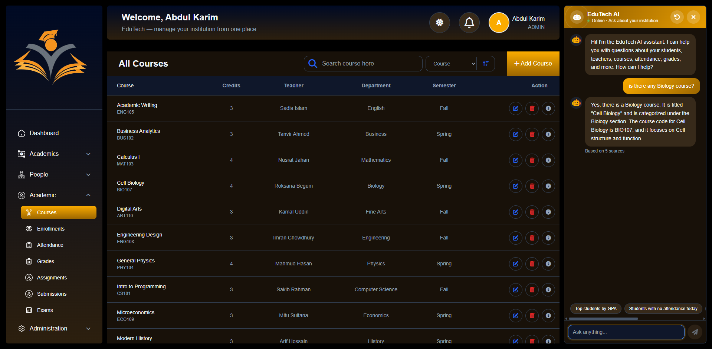

# 🎓 EduTech — AI-Powered Education Management System (RAG)

An end-to-end **Education Management System** with a retrieval-augmented generation (**RAG**) AI assistant. This monorepo contains two applications:

- **`admin/`** — Vue 3 admin dashboard (Ant Design Vue, Chart.js, TinyMCE editor, HLS video player, Excel export)
- **`backend/`** — REST API built with Node.js, Express, TypeScript, Prisma and PostgreSQL + [pgvector](https://github.com/pgvector/pgvector)

The built-in AI assistant answers questions about your institution — courses, assignments, library books and more — by embedding the question, retrieving the most relevant records through vector similarity search, and generating a grounded answer with locally running LLMs (Ollama). **The whole AI pipeline runs locally — no third-party AI provider is involved.**

## Features

**Complete education domain (full CRUD per module):**

| Area | Modules |
|---|---|
| Academic structure | Departments · Semesters · Courses · Classrooms · Schedules |
| People | Teachers · Students · Guardians · Student ⇄ Guardian links |
| Learning | Enrollments · Attendance · Grades · Assignments · Submissions · Exams |
| Administration | Payments · Office Hours · Advisement (academic advising) |
| Library | Library Books · Book Loans |